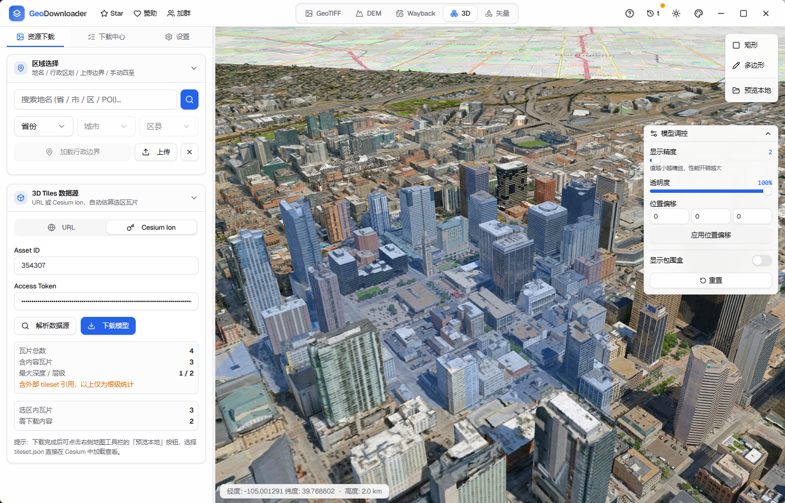
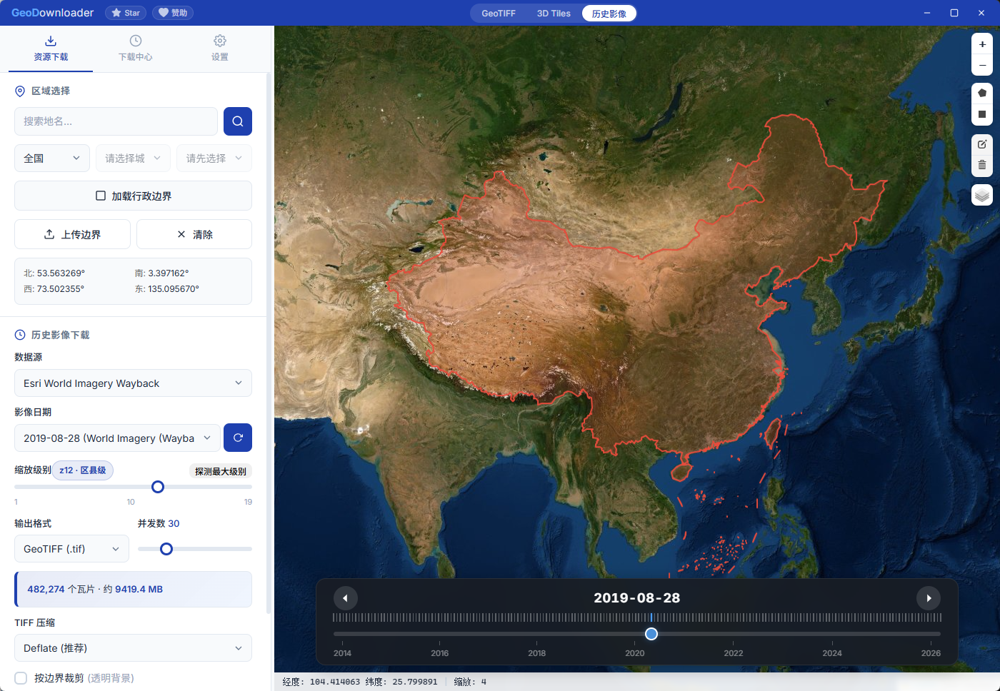
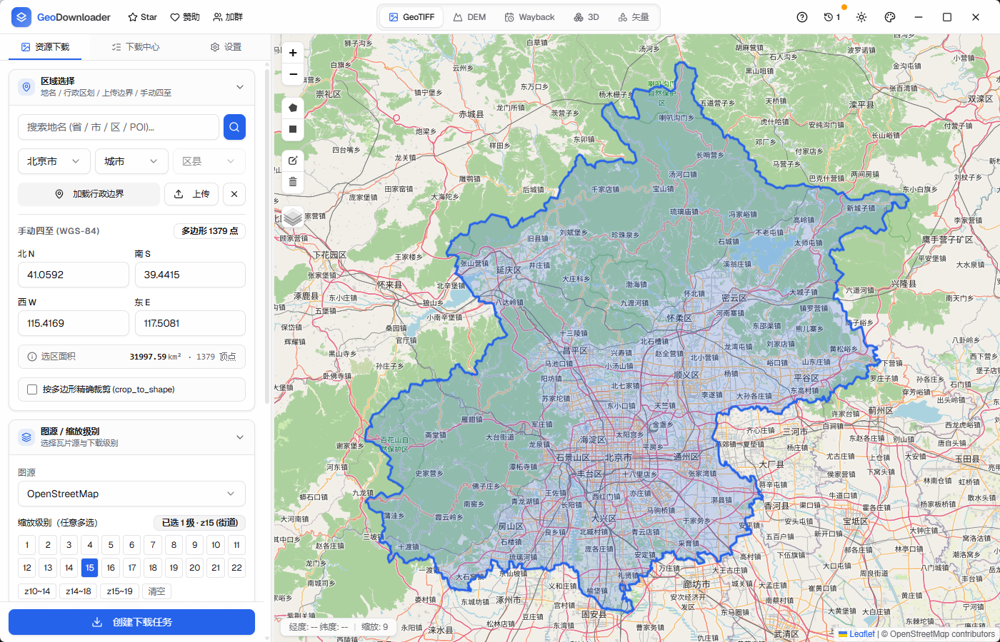

<h1 align="center">
  
</h1>

<p align="center">
  <b>一站式地理空间数据下载与导出桌面工具</b><br>
  2D 影像瓦片 · 矢量瓦片 · 3D Tiles · DEM · Esri Wayback 历史影像
</p>

<p align="center">
  <a href="https://geodownloader.pages.dev"><b>官网</b></a> ·
  <a href="https://github.com/gaopengbin/geo-downloader/releases/latest"><b>下载安装</b></a> ·
  <a href="https://github.com/gaopengbin/geo-downloader/discussions"><b>Discussions</b></a> ·
  <a href="https://github.com/gaopengbin/geo-downloader/issues"><b>Issues</b></a>
</p>

<p align="center">
  
  
  
  
  
</p>

<p align="center">
  
  
  
  
  
</p>

> **使用提示**：本工具是基于开源协议发布的桌面客户端，**不内置任何地图数据**。所有数据来自使用者自行配置的第三方服务，**请自行获取合法授权并遵守相关条款与法规**。下载所得数据版权归原数据方所有。详见 [使用条款与免责声明](https://geodownloader.pages.dev/disclaimer.html)。

---

## 下载安装

前往 [Releases](https://github.com/gaopengbin/geo-downloader/releases) 下载对应平台安装包：

| 平台 | 稳定版 | 预览版 (v3.4.0-beta.2) |
|---|---|---|
| Windows x64 | [latest setup.exe](https://github.com/gaopengbin/geo-downloader/releases/latest) | [3.4.0-beta.2 setup.exe](https://github.com/gaopengbin/geo-downloader/releases/download/v3.4.0-beta.2/GeoDownloader_3.4.0-beta.2_windows_x64-setup.exe) |
| macOS Apple Silicon | [latest arm64.dmg](https://github.com/gaopengbin/geo-downloader/releases/latest) | [3.4.0-beta.2 arm64.dmg](https://github.com/gaopengbin/geo-downloader/releases/download/v3.4.0-beta.2/GeoDownloader_3.4.0-beta.2_macos_arm64.dmg) |
| macOS Intel | [latest x64.dmg](https://github.com/gaopengbin/geo-downloader/releases/latest) | [3.4.0-beta.2 x64.dmg](https://github.com/gaopengbin/geo-downloader/releases/download/v3.4.0-beta.2/GeoDownloader_3.4.0-beta.2_macos_x64.dmg) |
| Linux (Debian/Ubuntu) | [latest .deb](https://github.com/gaopengbin/geo-downloader/releases/latest) | [3.4.0-beta.2 .deb](https://github.com/gaopengbin/geo-downloader/releases/download/v3.4.0-beta.2/GeoDownloader_3.4.0-beta.2_linux_amd64.deb) |
| Linux (AppImage) | [latest AppImage](https://github.com/gaopengbin/geo-downloader/releases/latest) | [3.4.0-beta.2 AppImage](https://github.com/gaopengbin/geo-downloader/releases/download/v3.4.0-beta.2/GeoDownloader_3.4.0-beta.2_linux_amd64.AppImage) |

> **预览版说明**：v3.4.0-beta.2 是前端整体迁移到 React 19 + shadcn/ui 的首个公开预览版，欢迎尝鲜并反馈，详见 [Release Notes](https://github.com/gaopengbin/geo-downloader/releases/tag/v3.4.0-beta.2)。

> macOS 首次打开提示"无法验证开发者"时：右键安装包 → 打开，或在「系统设置 → 隐私与安全性」放行。

---

## 功能总览

### 影像瓦片下载
- 内置 OSM、ArcGIS 卫星/地形/街道、天地图、Carto、Google、高德、OpenTopoMap 等数十个图源
- 支持自定义任意 `{z}/{x}/{y}` 模板，可配置 Subdomains、Referer、API Key
- 多任务并行 + 可调并发（10–100），实时进度
- 缩放级别区间下载，自动按图源最大级别约束
- 导出 GeoTIFF（带地理坐标，可选 LZW / Deflate 压缩）/ PNG / JPEG
- 按多边形边界裁剪（透明背景）

### 矢量瓦片
- MapboxVector / Mapbox GL Style 数据源
- 区域选择 + 缩放级别批量下载
- 模式独立的数据源记忆

### 3D Tiles
- Cesium Ion 资产、Google 3D Tiles（全球倾斜摄影）、自定义 URL
- 在 3D 视图框选区域裁剪下载
- 递归解析子 tileset，完整下载多层级 LOD
- 下载后 URI 自动本地化，支持离线 3D 浏览

<p align="center"></p>

### DEM 数字高程模型
- 多源 DEM（COP30 / SRTM 等）
- 按区域批量下载并拼接

### Esri Wayback 历史影像
- 浏览 Esri 卫星影像所有历史版本
- 时间轴交互，按拍摄日期切换
- 支持下载历史时刻的瓦片

<p align="center"></p>

### 区域选择
- 地名搜索定位
- 中国省 / 市 / 区县三级行政区划
- 上传 GeoJSON / Shapefile（`.zip` / `.shp + .shx + .dbf`） / KML / KMZ
- 地图绘制矩形或多边形

### 任务系统
- 多任务并行，独立进度与日志
- 崩溃重启可恢复任务
- 下载历史，一键打开输出文件夹

<p align="center"></p>

---

## 开发

### 环境要求
- [Rust](https://www.rust-lang.org/tools/install) 1.77+
- [Node.js](https://nodejs.org/) 20+（前端构建必需）

### 运行（开发模式）
```bash
# 安装前端依赖
npm ci --prefix frontend

# 启动 Tauri 开发服务（自动 vite dev + cargo build）
cd src-tauri
cargo tauri dev
```

### 构建发布
```bash
cd src-tauri
cargo tauri build
```
产物位于 `src-tauri/target/release/bundle/`。

### 项目结构
```
geo-downloader/
├── src-tauri/              # Rust 后端 (Tauri 2.x)
│   └── src/
│       ├── lib.rs / main.rs
│       ├── commands.rs     # Tauri 命令入口
│       ├── config.rs       # 内置图源 + 全局配置
│       ├── tile.rs         # 瓦片坐标计算
│       ├── downloader.rs   # 异步并发下载器
│       ├── merger.rs       # 拼接 / 裁剪
│       ├── exporter.rs     # GeoTIFF / PNG / JPEG 导出
│       ├── streaming_tiff.rs # BigTIFF 流式写入器
│       ├── wayback.rs      # Esri Wayback
│       ├── tiles3d/        # 3D Tiles 模块
│       ├── task.rs / history.rs / settings.rs
│       └── ...
├── frontend/               # React 19 + Vite + shadcn/ui + Tailwind
│   └── src/
├── site/                   # 官网静态站（Cloudflare Pages）
└── docs/                   # 设计 / 工作日志
```

---

## 配置说明

在应用「设置 / 高级选项」中可配置：

- **天地图 / Cesium Ion / Google API** Token
- **代理**：访问 Google 等海外图源时启用
- **并发数**：根据网络稳定性调整
- **TIFF 压缩**：无压缩 / LZW / Deflate

---

## 社区与反馈

- 使用问题、功能建议、案例分享 → [Discussions](https://github.com/gaopengbin/geo-downloader/discussions)
- Bug 报告 → [Issues](https://github.com/gaopengbin/geo-downloader/issues)
- 微信公众号 / 交流群

<p align="center">
  
  &nbsp;&nbsp;&nbsp;&nbsp;
  
</p>

---

## 更新历史

完整发布说明见 [Releases](https://github.com/gaopengbin/geo-downloader/releases)。近期亮点：

- **v3.4.0-beta**：前端整体迁移到 React 19 + shadcn/ui；Wayback 时间轴重设计；矢量区域选择器；二维码资源中心化
- **v3.3.x**：Wayback 历史影像批量下载；DEM 下载模块
- **v3.2.x**：TIFF 压缩三选一；任务日志系统；断点续传增强；BigTIFF 兼容性修复
- **v3.0.0**：产品更名 GeoDownloader；3D Tiles 下载与离线预览

---

## 许可证

[MIT License](LICENSE) © 2025–2026 gaopengbin

---

## 赞助

如果这个项目对你有帮助，欢迎请作者喝杯咖啡。

<p align="center">
  
  &nbsp;&nbsp;&nbsp;&nbsp;
  
</p>

---

## Star History

[](https://star-history.com/#gaopengbin/geo-downloader&Date)
