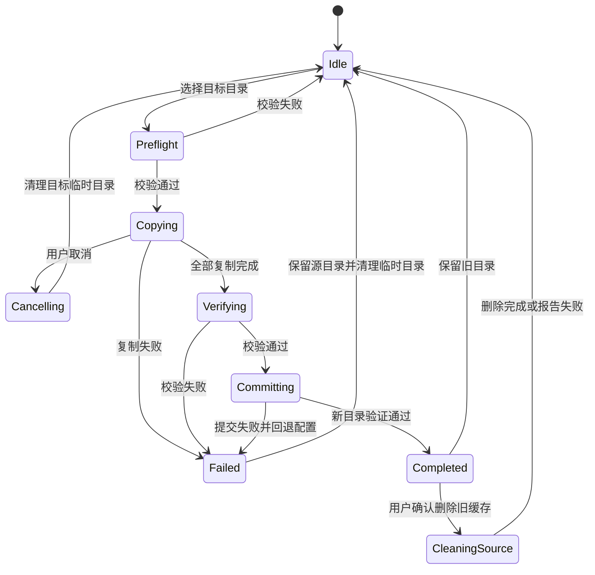

# 瓦片缓存目录迁移 - 技术设计文档（RFC）

> 创建日期：2026-06-11
> 状态：已实施
> 实施日期：2026-06-11
> 目标版本：下一版本
> 优先级：P1
> 关联模块：`tile_cache`、设置面板、Tauri 事件系统

---

## 1. 背景

GeoDownloader 默认将瓦片缓存写入系统本地数据目录：

```text
Windows: %LOCALAPPDATA%\geo-downloader\tile_cache
macOS:   ~/Library/Application Support/geo-downloader/tile_cache
Linux:   ~/.local/share/geo-downloader/tile_cache
```

Windows 用户通常把系统盘作为默认目录。持续浏览和下载高层级影像后，单个
`.mbtiles` 文件可能增长到数 GB 甚至数十 GB，最终占满 C 盘。

当前设置页允许选择新的缓存目录，但实际行为是：

1. 立即关闭旧目录的 SQLite 连接；
2. 将后续缓存写入新目录；
3. 旧目录中的缓存文件留在原处；
4. 不复制、不校验，也不提示旧目录仍占用磁盘。

该行为属于“切换未来存储位置”，不是用户通常理解的“迁移缓存”。本设计增加类似
Steam 游戏库迁移的完整工作流，在保留既有缓存的前提下，将缓存安全搬到其他磁盘。

---

## 2. 设计目标

### 2.1 核心目标

1. 将当前缓存目录中的全部缓存迁移到用户选择的新目录。
2. 迁移成功并校验通过前，应用始终使用旧目录。
3. 迁移失败、取消或应用崩溃时，旧缓存保持完整且仍可使用。
4. 提供文件数、已复制容量、总容量、当前文件和百分比进度。
5. 迁移成功后由用户决定是否删除旧目录，默认保留。
6. 支持跨磁盘迁移，不依赖文件系统 `rename`。
7. 目标目录空间不足、路径冲突或不可写时，在复制前阻止迁移。

### 2.2 非目标

1. 首期不做云端同步或跨设备同步。
2. 首期不支持迁移部分图源，迁移粒度为整个缓存目录。
3. 首期不合并两个已有且都包含缓存的目录。
4. 首期不在迁移时压缩、重建或清理 MBTiles 数据库。
5. 迁移功能不负责自动执行容量淘汰。

---

## 3. 数据安全原则

迁移必须遵守以下硬规则：

1. **默认不删除**：任何自动流程不得删除旧缓存。
2. **先复制，后切换**：全部复制和校验成功后才更新 `settings.json`。
3. **配置最后提交**：迁移过程中配置始终指向旧目录。
4. **失败可回退**：失败或取消只清理目标端临时文件，不修改源目录。
5. **删除需二次确认**：旧目录删除必须由用户在迁移成功后明确触发。
6. **不静默覆盖**：目标目录存在同名缓存文件时，不直接覆盖。
7. **数据库一致性优先**：复制前必须停止缓存写入并关闭所有 SQLite 连接。

迁移采用“两阶段提交”：

```text
阶段一：准备和复制
旧目录仍是正式目录
目标写入 <target>/.geo-downloader-migration-<id>/

阶段二：校验和提交
校验全部通过
临时目录改名为正式 tile_cache
原子保存 settings.json
重新打开新目录验证
```

只有阶段二全部完成，迁移才算成功。

---

## 4. 用户交互

### 4.1 设置页调整

当前可编辑的“缓存目录”输入框改为只读路径展示，主界面仅提供安全的迁移操作：

| 操作 | 行为 |
|---|---|
| 迁移缓存 | 搬运已有数据，成功后切换到新目录 |

现有 `cache_set_dir` 后端命令保留用于兼容，但首期不在设置页暴露“只切换不迁移”
入口，避免用户再次把目录切换误解为数据搬迁。

### 4.2 迁移确认对话框

选择目标目录后显示：

```text
迁移瓦片缓存

当前位置：C:\Users\...\geo-downloader\tile_cache
目标位置：D:\GeoDownloader\cache
缓存大小：18.6 GB，共 29 个文件
目标盘可用：124 GB

[取消] [开始迁移]
```

如果目标空间不足：

```text
目标磁盘空间不足
迁移至少需要 18.6 GB，建议保留额外 1 GB 空间。
当前可用空间为 12.3 GB。
```

### 4.3 迁移进度

迁移期间显示不可重复启动的进度对话框：

```text
正在迁移缓存
google_satellite.mbtiles
8.4 GB / 18.6 GB
45%

[取消迁移]
```

说明：

- 迁移期间暂停新的缓存读写。
- 普通下载任务可以选择阻止迁移开始，而不是强制取消用户任务。
- 取消按钮只取消复制，不影响源缓存。

### 4.4 迁移完成

```text
缓存迁移完成
18.6 GB 缓存已迁移到 D:\GeoDownloader\cache

旧缓存仍保留在：
C:\Users\...\geo-downloader\tile_cache

[稍后处理] [删除旧缓存]
```

“删除旧缓存”再次显示不可恢复确认，并展示将释放的空间。

---

## 5. 状态机



状态定义：

| 状态 | 含义 |
|---|---|
| `idle` | 无迁移任务 |
| `preflight` | 检查路径、空间、权限、冲突 |
| `copying` | 复制缓存文件 |
| `verifying` | 校验目标文件 |
| `committing` | 切换配置并验证新目录 |
| `completed` | 已切换，新旧目录均可能存在 |
| `cancelling` | 响应取消并清理临时文件 |
| `failed` | 迁移失败，仍使用旧目录 |

---

## 6. 后端设计

### 6.1 新模块

新增：

```text
src-tauri/src/cache_migration.rs
```

职责：

- 迁移预检；
- 迁移状态管理；
- 复制与校验；
- 取消控制；
- 崩溃恢复记录；
- 提交和回退；
- 旧目录清理。

`tile_cache::Store` 只提供连接关闭、重新打开和缓存访问能力，不承载迁移状态机。

### 6.2 运行时状态

```rust
pub struct CacheMigrationManager {
    active: Mutex<Option<ActiveMigration>>,
}

pub struct ActiveMigration {
    id: String,
    source_dir: PathBuf,
    target_dir: PathBuf,
    staging_dir: PathBuf,
    cancel: CancellationToken,
}
```

通过 Tauri：

```rust
.manage(Arc::new(CacheMigrationManager::new()))
```

保证同一时间只有一个迁移任务。

### 6.3 持久化迁移记录

记录文件：

```text
<app_data_dir>/cache-migration.json
```

示例：

```json
{
  "version": 1,
  "id": "uuid",
  "status": "copying",
  "sourceDir": "C:\\Users\\...\\tile_cache",
  "targetDir": "D:\\GeoDownloader\\cache",
  "stagingDir": "D:\\GeoDownloader\\.geo-downloader-migration-uuid",
  "totalBytes": 19973242880,
  "copiedBytes": 8514437120,
  "createdAt": "2026-06-11T10:30:00Z",
  "updatedAt": "2026-06-11T10:42:00Z"
}
```

状态更新使用项目现有 `fs_util::atomic_write`。首期崩溃恢复策略采用保守方案：

- 启动时发现 `copying/verifying`：继续使用旧目录；
- 提示用户“发现未完成的缓存迁移”；
- 提供“重新开始迁移”或“清理未完成文件”；
- 首期不实现断点续拷，以降低错误恢复复杂度。

### 6.4 预检

`preflight` 必须检查：

1. 源目录存在且可读。
2. 目标路径不是源目录或源目录的子目录。
3. 源目录不是目标目录的子目录。
4. 目标目录可创建、可写。
5. 目标目录不是文件。
6. 目标正式缓存目录不存在，或存在但为空。
7. 临时迁移目录不存在；若存在，必须先由用户确认清理。
8. 目标盘可用空间大于：

```text
源缓存实际大小 + 1 GB 安全余量
```

9. 当前没有活动下载或缓存写入任务。
10. 当前没有其他迁移任务。

磁盘空间获取：

- 优先使用 Rust 跨平台磁盘信息库；
- 如不希望新增依赖，可按平台实现系统调用；
- 进入实施阶段后再根据现有依赖策略确定。

### 6.5 源文件范围

迁移以下文件：

```text
*.mbtiles
*.mbtiles-wal
*.mbtiles-shm
```

但复制前执行：

```rust
tile_cache::Store::global().shutdown();
```

正常情况下 WAL 会 checkpoint 回主库，`-wal/-shm` 应消失或为空。文件枚举仍包含副文件，
用于处理异常关闭遗留场景。

不迁移：

- 应用日志；
- `settings.json`；
- Wayback 元数据缓存；
- 下载任务临时目录；
- 用户导出的 MBTiles/GPKG/TIFF 文件。

### 6.6 复制策略

每个文件按固定大小缓冲区流式复制，建议 8 MB：

```text
open source
create target.part
loop:
  read 8 MB
  write_all
  更新 copiedBytes
  检查 cancel token
flush + sync_all
rename target.part -> target filename
```

约束：

- 不使用 `std::fs::copy`，因为无法提供细粒度进度和取消。
- 单个文件先写 `.part`，完成后再改名。
- 取消或失败时删除目标端 `.part`。
- 目标正式文件不存在时才允许改名。

### 6.7 校验策略

首期采用两层校验：

1. 每个文件大小与源文件一致。
2. 对每个 `.mbtiles` 执行 SQLite 快速校验：

```sql
PRAGMA quick_check;
SELECT COUNT(*) FROM tiles;
```

源库和目标库的 `tiles` 数量必须一致。

不建议首期对数十 GB 文件计算全量 SHA-256：

- 会额外完整读取源和目标各一次；
- 机械硬盘迁移耗时可能翻倍；
- SQLite `quick_check` + 文件大小 + 瓦片数对本场景已具备较高保障。

后续可增加“完整校验”高级选项。

### 6.8 提交

提交顺序：

1. 确认目标临时目录全部校验通过。
2. 将目标临时目录改名为正式缓存目录。
3. 保存旧配置快照。
4. 原子更新 `settings.json.tile_cache_dir`。
5. 调用 `tile_cache::set_root_dir(new_dir)`。
6. 调用 `Store::stats()` 验证新目录可读。
7. 验证失败时恢复旧配置和旧 `root_dir`。
8. 写入 `completed` 迁移记录，包含旧目录路径。

任何步骤失败，都不得删除源目录。

### 6.9 删除旧目录

删除旧目录是独立命令，不属于迁移提交：

```rust
cache_delete_migration_source(migration_id: String)
```

命令必须校验：

1. 迁移状态为 `completed`。
2. 待删除路径等于记录中的 `source_dir`。
3. 待删除路径不等于当前缓存目录。
4. 路径位于记录的明确目录中，不接受前端传入任意路径。
5. 当前新目录仍可读取。

删除失败时保留迁移记录，允许用户重试或手动处理。

---

## 7. Tauri 命令与事件

### 7.1 命令

```rust
cache_migration_preflight(target_dir: String)
    -> CacheMigrationPreflight

cache_migration_start(target_dir: String)
    -> CacheMigrationStarted

cache_migration_status()
    -> Option<CacheMigrationStatus>

cache_migration_cancel(migration_id: String)
    -> ()

cache_migration_cleanup_staging(migration_id: String)
    -> u64

cache_migration_delete_source(migration_id: String)
    -> u64
```

`cache_set_dir` 保留为“仅更改未来存储位置”的高级命令，不再由主目录选择按钮直接调用。

### 7.2 预检返回

```ts
interface CacheMigrationPreflight {
  sourceDir: string
  targetDir: string
  totalBytes: number
  fileCount: number
  availableBytes: number
  requiredBytes: number
  canStart: boolean
  blockers: string[]
  warnings: string[]
}
```

### 7.3 进度事件

事件名：

```text
cache-migration-progress
```

载荷：

```ts
interface CacheMigrationProgress {
  migrationId: string
  status:
    | 'preflight'
    | 'copying'
    | 'verifying'
    | 'committing'
    | 'completed'
    | 'cancelled'
    | 'failed'
  currentFile: string | null
  fileIndex: number
  fileCount: number
  copiedBytes: number
  totalBytes: number
  percent: number
  message: string
  error: string | null
}
```

事件频率限制为每 100 ms 最多一次，避免大文件复制时淹没前端事件队列。

---

## 8. 并发与应用生命周期

### 8.1 迁移期间的缓存访问

迁移开始前：

1. 检查活动下载任务。
2. 禁止启动新的缓存写入。
3. 等待正在执行的 `get/put/put_batch` 完成。
4. 执行 `Store::shutdown()`。
5. 开始复制。

建议在 `tile_cache` 外增加全局迁移状态：

```rust
enum CacheAvailability {
    Available,
    Migrating,
}
```

迁移期间：

- `cache_get_tile` 返回“缓存迁移中”或按未命中处理；
- `cache_put_tile` 静默跳过缓存写入；
- 下载主流程不应失败，可继续走网络和正常导出；
- 设置页禁止清空缓存、切换目录和修改容量。

### 8.2 活动下载任务

首期不尝试在下载中途强制迁移。发现活动任务时阻止开始：

> 当前有下载任务正在使用缓存。请等待任务结束或取消任务后再迁移。

这样可以避免迁移功能侵入下载暂停、恢复和临时目录逻辑。

### 8.3 关闭应用

迁移时关闭窗口仍按现有逻辑隐藏到托盘，迁移继续。

用户从托盘选择“退出”时：

1. 请求取消迁移；
2. 等待当前文件缓冲区写入停止；
3. 保存迁移记录；
4. 清理 `.part` 文件；
5. 再退出进程。

不允许进程在目标文件写入过程中直接退出。

---

## 9. 目标目录冲突

目标目录分三类：

### 9.1 空目录

允许迁移。

### 9.2 已有 GeoDownloader 缓存

首期阻止迁移，并提示：

> 目标位置已经包含 GeoDownloader 缓存。请选择空目录，以避免覆盖或合并错误。

后续版本可设计合并流程，但需逐库处理坐标冲突，不能简单覆盖文件。

### 9.3 普通非空目录

允许在其下创建专用子目录：

```text
用户选择：D:\GIS
实际目录：D:\GIS\GeoDownloader\cache
```

预检界面必须展示最终实际路径，避免用户误解。

---

## 10. 容量上限的产品语义

迁移功能与容量限制应分开设计。

当前 `cache_set_max_size_mb` 会立即调用 `prune`，而 `prune` 按图源整库删除。这意味着用户将
上限设为 5 GB 时，一个 18 GB 的唯一图源缓存可能被整库删除。

在实施迁移功能前，应另行确认容量策略。推荐原则：

1. 修改容量上限不自动删除既有缓存。
2. 达到上限时停止新增缓存，仍允许读取既有缓存。
3. 明确提示“已达到缓存上限”。
4. 删除缓存只能由用户在分图源列表或“清空缓存”操作中触发。
5. 若未来增加自动淘汰，必须独立提供开关并解释淘汰粒度。

该容量策略不是本 RFC 的实施内容，但与“避免用户数据丢失”具有同一优先级。

---

## 11. 测试计划

### 11.1 Rust 单元测试

1. 源目录和目标目录相同。
2. 目标位于源目录内部。
3. 源目录位于目标目录内部。
4. 目标不可写。
5. 目标空间不足。
6. 目标已有同名缓存。
7. 空缓存目录迁移。
8. 多个 MBTiles 文件迁移。
9. 大文件分块复制进度。
10. 复制中取消，源文件不变。
11. 复制失败，配置不变。
12. 校验失败，配置不变。
13. 提交后新目录可读取。
14. 提交失败时恢复旧配置。
15. WAL checkpoint 后迁移。
16. 删除旧目录必须匹配迁移记录。
17. 不允许删除当前生效目录。

### 11.2 集成测试

1. 使用临时目录创建真实 SQLite/MBTiles。
2. 迁移后比较文件大小、瓦片数和 `quick_check`。
3. 模拟复制到一半取消。
4. 模拟目标盘写入错误。
5. 模拟配置保存失败。
6. 模拟提交完成后应用重启。
7. 模拟存在未完成迁移记录的启动恢复。

### 11.3 前端测试

1. 预检失败时禁止开始。
2. 正确显示容量和空间。
3. 进度事件更新。
4. 迁移期间按钮禁用。
5. 取消确认。
6. 完成后默认不删除旧缓存。
7. 删除旧缓存二次确认。
8. 崩溃恢复提示。

### 11.4 手工验收

至少覆盖：

- Windows C 盘迁移到 D 盘；
- Windows NTFS 跨盘迁移 20 GB 以上缓存；
- macOS 外接磁盘；
- Linux 不同挂载点；
- 中文、空格和超长路径；
- 机械硬盘低速迁移；
- 迁移时尝试关闭应用；
- 迁移后离线浏览缓存。

---

## 12. 分阶段实施

### 第一阶段：安全迁移主流程

- 预检；
- 全量复制；
- 文件大小 + SQLite 校验；
- 进度和取消；
- 成功后切换；
- 旧目录默认保留。

### 第二阶段：恢复与清理

- 未完成迁移启动提示；
- 清理目标临时目录；
- 删除旧缓存；
- 完善退出处理。

### 第三阶段：增强能力

- 断点续拷；
- 完整哈希校验；
- 已有缓存目录合并；
- 单图源迁移；
- 迁移速度和剩余时间估算。

---

## 13. 验收标准

满足以下条件才可发布：

1. 迁移失败或取消的所有路径中，源缓存字节不发生变化。
2. 迁移成功前 `settings.json` 不指向目标目录。
3. 迁移成功后应用可从新目录命中并读取缓存。
4. 未经用户明确确认，旧目录不会被删除。
5. 20 GB 缓存跨盘迁移有连续进度反馈，界面不卡死。
6. 应用重启后能识别未完成迁移，不误用半成品目录。
7. 目标空间不足时不开始复制。
8. 活动下载任务存在时不允许开始迁移。
9. `cargo test`、`cargo check` 和前端构建通过。

---

## 14. 实施决策

1. 设置页首期不提供“仅更改未来存储位置”的高级入口，后端命令仅保留兼容性。
2. 用户选择空目录时直接使用该目录；选择普通非空目录时使用其下的
   `GeoDownloader/cache`，确认页展示最终路径；已有缓存目录不允许覆盖。
3. 迁移开始前若已有活动下载则阻止开始；迁移开始后新下载仍可继续，但缓存读写按
   未命中/跳过处理。
4. `completed`、`failed` 或 `cancelled` 记录持续显示处理入口，直到用户删除旧缓存或
   清理临时文件。
5. 容量上限策略保持独立，本次不改变自动淘汰语义。
